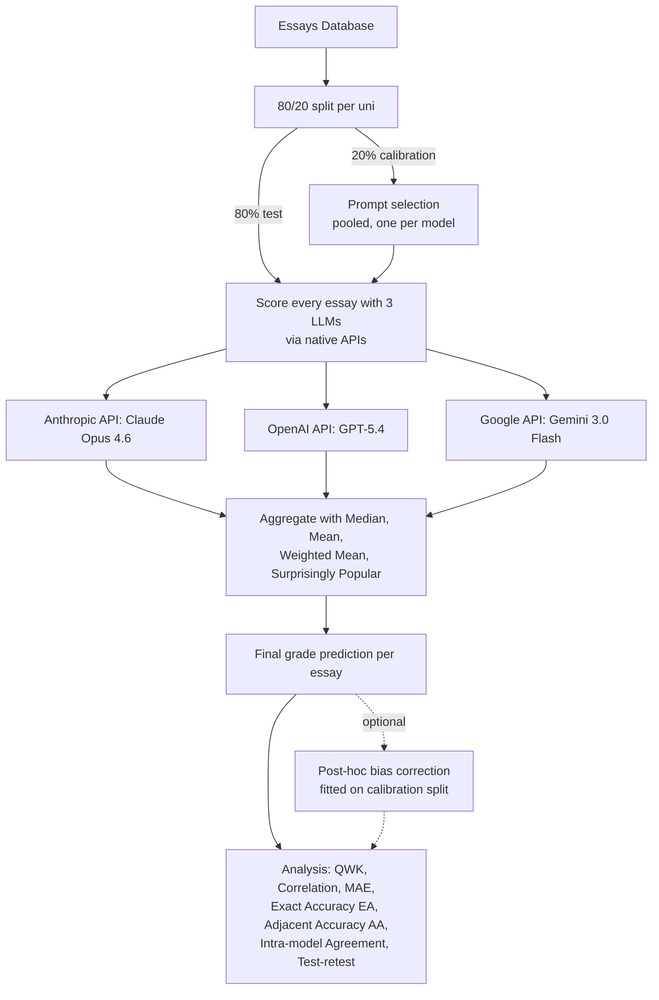

# Machine–human agreement in marking undergraduate assignments is specific to model, prompt and institution
   
## Abstract

Large language models (LLMs) promise to automate one of higher education's most resource-intensive activities: assessing student writing. Existing evaluations are typically limited to a single model, a single prompt and a single institution. Using 761 undergraduate psychology assignments from three UK universities, we evaluated three frontier LLMs, individually and in ensemble, on accuracy, prompt sensitivity, error independence, generalisability and evidential basis. Agreement between human and machine marks varied widely, with no model or prompt optimal across institutions. All models compressed marks towards a common central tendency, overvaluing the weakest assignments and undervaluing the strongest. Because this error was shared, ensembling failed to remove it. Machine marks also rewarded surface linguistic features more strongly than human marks. Since human–machine agreement was a joint product of model, prompt and institution, we conclude that current LLMs lack evaluative capacity transferable across contexts, and that single-context validation overstates readiness for deployment.


## Repo Overview

Automated essay grading using a small ensemble of LLMs (Claude, GPT, Gemini), evaluated against human markers across three UK universities: Cambridge, Manchester Metropolitan University, and Nottingham.

All calls go through the native provider APIs (Anthropic, OpenAI, Google) at temperature 0, behind a uniform scoring interface, so prompt construction, response parsing, and grade extraction are identical across models. Test-retest reruns use the same wrappers and endpoints as the main scoring pass.

## Pipeline



## Setup

```bash
poetry install
cp .env.example .env   # then fill in the API keys and model IDs
```

## Reproducing results

### 1. Calibrate prompts

Scores the 20% calibration split under all 27 parametric prompt designs, then selects **one prompt configuration per model** — the design minimising RMSE against human marks on the *pooled* calibration split (all three institutions together). That single configuration is deployed unchanged at every institution. Only the aggregation weights are institution-specific: each institution's inverse-RMSE weights are derived from its own calibration RMSE under the selected configuration.

```bash
poetry run calibrate split      # inspect the cal/test partition
poetry run calibrate score      # score cal essays: 27 prompts × 3 models
poetry run calibrate analyse    # pooled prompt selection + per-institution weights
```

Each command takes an optional `--university` to narrow which institutions are scored or written; prompt selection always pools all three regardless, since the deployed configuration is common to them. Per-institution optima are *not* deployed — they are unstable across models and are reported only as a counterfactual in the transfer analysis.

The 27 prompt designs live in [src/prompts/prompt_library.json](src/prompts/prompt_library.json), rendered per institution by [prompt_renderer.py](src/prompts/prompt_renderer.py). `analyse` refuses to run against a partially scored calibration sweep, so complete `calibrate score` first.

### 2. Score essays (requires API keys)

```bash
poetry run score cambridge
poetry run score mmu
poetry run score nottingham
```

### 3. Run analyses

In the order they appear in the paper:

```bash
python analysis/accuracy/compute_metrics.py           # accuracy & agreement metrics
python analysis/accuracy/ensemble_delta_qwk.py        # ensemble vs best model (paired bootstrap ΔQWK)
python analysis/accuracy/shared_errors.py             # do the three models' errors covary?
python analysis/prompt_sensitivity/factorial_analysis.py  # 3×3×3 factorial, RM-ANOVA, contrasts
python analysis/transfer/location_analysis.py         # cross-institution transfer
python analysis/bias_correction/learn_bias_shift.py   # post-hoc corrections fitted on cal split
python analysis/reliability/test_retest.py            # test-retest reliability (--report-only to skip scoring)
```

All analyses evaluate on the 80% test split, restricted to complete cases (non-null scores from all three models and the ensemble). Each writes its results to its own `output/` directory.

## Project structure

```
src/
  classifier/
    models/                 # Native API wrappers: Claude, GPT, Gemini
    aggregators/            # median, simple mean, weighted mean, surprisingly popular
    orchestrator.py         # runs all models + aggregators per essay
    prompt_manager.py       # builds the final prompt sent to each model
  config/institutions/      # per-uni grade scales + best prompts (from calibration)
  prompts/                  # 27 parametric prompt templates + renderer
  utils/                    # scoring, db, calibration, analysis helpers

scripts/
  run_scoring.py            # main scoring pipeline
  run_calibration.py        # prompt sweep on the calibration split

analysis/                   # one package per paper analysis
```

## Data sources
The analysis scripts read the private SQLite database which holds essay text and cannot be shared. The de-identified numbers used in the paper are published separately at 10.5281/zenodo.21676733. Reproducing the published figures from those files requires substituting your own loader for get_connection() / load_complete_case_data(). The metric functions in src/utils/analysis_utils.py take plain arrays and need no changes.


## Contributions

The code in this repository was written by G. Corsi, with the exception of [analysis/linguistic_features/](analysis/linguistic_features/), written by M. Abo-Tabik.
